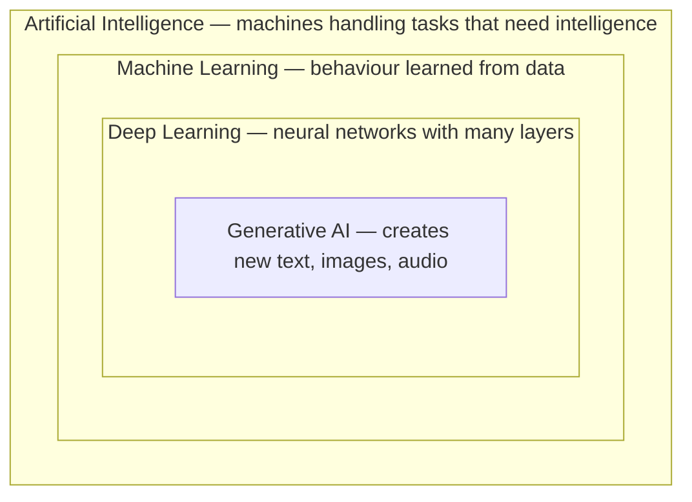

# AI Foundations

What a machine really does when it "learns"

---
layout: section
---

# Making Sense of AI

---
layout: why
---

# Everyone says "AI". Almost nobody means the same thing.

---

# The problem with the word

- A software vendor calls a sorting rule "AI-powered"
- A colleague is convinced that ChatGPT "understands" him
- A headline promises your job will be gone by Friday
- Meanwhile you have to decide: do I trust this answer or not?

Without a mental model, the only options are blind trust or blanket rejection.

---
layout: little-what
---

# AI is software that learns patterns from data instead of following rules a human wrote.

---
layout: two-cols-header
layoutClass: gap-x-8
---

# Two ways to build a spam filter

::left::

**The classic way**

A developer writes down the rules:

- Subject says "free money" → spam
- Sender unknown → suspicious
- More than five links → spam

Every new trick needs a new rule.

::right::

**The learning way**

You hand over examples:

- 100,000 emails, each marked spam or not spam
- The machine works out what the spam ones have in common
- Nobody ever writes a rule

::bottom::
<Callout type="info">
The shift: instead of telling the computer how to decide, you show it what a good decision looks like.
</Callout>

---

# One word, four different things

ChatGPT lives in the innermost box. Everything said about "AI" in general may or may not apply to it.

---

# What "learning" actually means

A model is a huge pile of numbers that gets adjusted step by step.

1. The model makes a guess
2. The guess is compared against the known correct answer
3. The numbers are nudged so the next guess lands closer
4. Repeat, millions of times

No understanding is involved anywhere. Just an error getting smaller.

---
layout: two-cols-header
layoutClass: gap-x-8
---

# An analogy: guessing apartment prices

::left::

Show someone 10,000 apartments together with the price each one sold for.

After a while they notice the patterns: more square metres cost more, top floor adds a little, far from the centre takes a lot off.

::right::

Nobody ever gave them a formula, and they could not fully explain their estimate.

Ask about apartment 10,001 and you get a solid guess. Ask about a houseboat and you get a confident, useless one.

::bottom::
<Callout type="warning">
A model is only as good as the examples it saw. Outside that range it stays just as confident.
</Callout>

---
layout: sub-section
---

# Three ways a machine can learn

---
layout: two-cols-header
layoutClass: gap-x-8
---

# Supervised: learning from labelled examples

::left::

**The data comes with the right answer attached**

- Emails marked spam or not spam
- X-rays marked healthy or suspicious
- Old invoices marked paid on time or late

::right::

**Where you meet it at work**

- Documents sorted automatically in the DMS
- Credit scoring at the bank
- Sales forecasts for next quarter

::bottom::
<Callout type="info">
Somebody has to label all those examples first. That is usually the expensive part of the project.
</Callout>

---
layout: two-cols-header
layoutClass: gap-x-8
---

# Unsupervised: finding structure without answers

::left::

**No labels. The machine groups what belongs together**

- Customers with similar buying behaviour
- Support tickets caused by the same problem
- Payments that look unlike all the others

::right::

**Where you meet it at work**

- Customer segments for a campaign
- Fraud and anomaly detection
- Clustering hundreds of survey answers

::bottom::
<Callout type="warning">
Nobody tells the machine what the groups mean. Interpreting them stays your job.
</Callout>

---

# Reinforcement: learning by trial and reward

- The machine tries something, receives a reward or a penalty, and adjusts
- There is no correct answer to copy, only feedback on how it went
- It needs enormous numbers of attempts, so training usually happens in simulation

Classic examples are a robot learning to walk and AlphaGo beating the world champion at Go.

The thumbs up and thumbs down buttons in ChatGPT belong to this family too.

---

# The three at a glance

| | Supervised | Unsupervised | Reinforcement |
|---|---|---|---|
| **Data** | Examples with answers | Examples without answers | Feedback after each attempt |
| **Question** | Which label fits? | What belongs together? | What earns the best outcome? |
| **Example** | Spam filter | Customer segments | Robot learning to walk |

---

# Where ChatGPT fits in

1. **Self-supervised pretraining** — read enormous amounts of text and predict the next word. The text is its own answer key, so no human labelling is needed.
2. **Supervised fine-tuning** — humans write example conversations that show what a good answer looks like.
3. **Reinforcement from human feedback** — humans rank competing answers, and the model learns which ones earn approval.

<Callout type="info">
All three ideas end up in a single product. We take that apart in the next lesson.
</Callout>

---

# What today's AI is not

- It does not understand meaning. It predicts what fits.
- It does not look up facts unless you give it a tool for that.
- It has no goals, opinions or feelings of its own.
- It is not reliable in the way a calculator is. The same question can yield different answers.

<Callout type="important">
This is not pessimism. Knowing the limits is exactly what lets you use it with confidence.
</Callout>

---
layout: what-if
---

# What if the machine learns the wrong pattern?

---

# Patterns nobody asked for

- A hiring model trained on past hires learns who got hired before, not who did the job well
- A skin cancer model learns to spot the ruler doctors place next to serious lesions
- A model trained on the open internet inherits every blind spot the internet has

The model never notices that it went wrong. Only a human can.

---
layout: task
---

# Find the AI in your own workday

---

# What to take away

- AI is software that learns patterns from data instead of following rules a human wrote
- Supervised learning needs labelled examples, unsupervised finds structure without them, reinforcement learns from feedback
- ChatGPT combines all three, which is why it can be pointed at almost any text task
- A model fails quietly outside the data it saw. It never notices, so a human has to

---
layout: ask-me-anything
---
