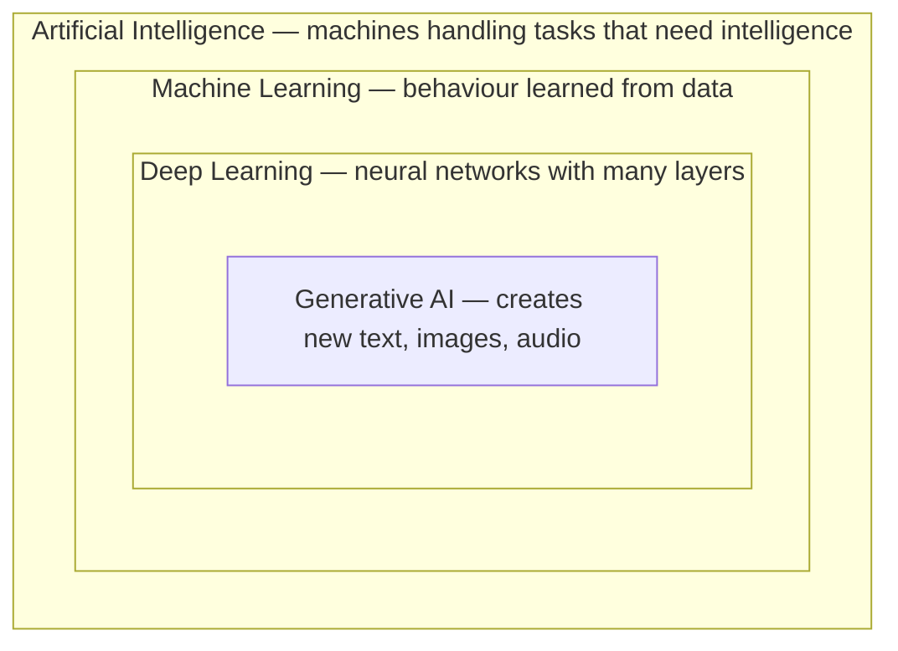

# What ChatGPT Is

One tool, almost any text task

---
layout: section
---

# Making Sense of ChatGPT

---
layout: why
---

# Everyone says "AI". Almost nobody means the same thing.

---

# The problem with the word

- A software vendor calls a sorting rule "AI-powered"
- A colleague is convinced that ChatGPT "understands" him
- A headline promises your job will be gone by Friday
- Meanwhile you have to decide: do I trust this answer or not?

Without a mental model, the only options are blind trust or blanket rejection. Both are expensive.

---
layout: little-what
---

# ChatGPT is software that learned patterns from enormous amounts of text — and it continues yours with whatever fits best.

---
layout: two-cols-header
layoutClass: gap-x-8
---

# Two ways to build a spam filter

::left::

**The classic way**

A developer writes down the rules:

- Subject says "free money" → spam
- Sender unknown → suspicious
- More than five links → spam

Every new trick needs a new rule.

::right::

**The learning way**

You hand over examples:

- 100,000 emails, each marked spam or not spam
- The machine works out what the spam ones have in common
- Nobody ever writes a rule

::bottom::
<Callout type="info">
The shift: instead of telling the computer how to decide, you show it what a good decision looks like.
</Callout>

---

# One word, four different things

ChatGPT lives in the innermost box. Everything said about "AI" in general may or may not apply to it.

---
layout: two-cols-header
layoutClass: gap-x-8
---

# From one job to any job

::left::

**A specialised model**

- Trained for a single task
- Needs its own labelled data
- Months from idea to production
- Fails outside its narrow purpose

::right::

**A language model**

- Trained on text in general
- Adapted by asking differently
- Seconds from idea to first result
- Mediocre at many things, excellent at some

::bottom::
<Callout type="info">
You no longer change the software to get a new behaviour. You change the sentence you type.
</Callout>

---

# Why text was the key

Look at a normal working week: emails, meeting notes, specifications, offers, documentation, reports, presentations.

Almost all knowledge work arrives as text and leaves as text.

A machine that can handle text in general can touch every one of those steps — without anyone building a separate tool for each.

---
layout: two-cols-header
layoutClass: gap-x-8
---

# What it is good at, what it is not

::left::

**Reliably useful**

- Turning rough notes into clean prose
- Changing tone, length or language
- Summarising something long
- Explaining a topic at any level
- Producing ten options in a minute

::right::

**Reliably risky**

- Facts nobody gave it
- Arithmetic and exact counting
- Knowing what it does not know
- Anything about today without a tool
- Giving the same answer twice

::bottom::
<Callout type="warning">
Notice the pattern: it is strong at shaping material and weak at sourcing it. Bring the material yourself.
</Callout>

---
layout: two-cols-header
layoutClass: gap-x-8
---

# So is it a better Google?

::left::

**Use a search engine when**

- You need a source you can cite
- The answer has to be current
- It matters who is saying it
- You want one specific fact, fast

::right::

**Use ChatGPT when**

- You have material that needs reshaping
- You cannot yet name what you are looking for
- You want it explained at your level
- You need options rather than one answer

::bottom::
<Callout type="warning">
Treating it as a search engine is the most common beginner mistake, and the one that produces invented sources.
</Callout>

---
layout: two-cols-header
layoutClass: gap-x-8
---

# The app is not the model

::left::

**The model**

The engine. It takes text and produces text.

On its own it cannot browse the web, remember you or open a file.

::right::

**ChatGPT**

The product built around the engine.

It adds the chat window, memory, file uploads, web search, images and voice.

::bottom::
<Callout type="info">
Worth remembering when something does not work: often the limit is a missing tool, not a lack of intelligence.
</Callout>

---
layout: what-if
---

# What if it also knew everything your company knows?

---
layout: task
---

# Where would it actually help you?

---

# What to take away

- Classic software follows rules a person wrote. This learned its behaviour from examples
- A specialised model needs rebuilding for a new job. A language model needs a different sentence
- It is strong at reshaping material you supply and weak at sourcing facts you do not
- Use a search engine for a citable, current source. Use ChatGPT when you have material or cannot yet name what you want
- Giving it your company's knowledge is a real option, through files and projects, and that is what Lessons 2 and 5 build

---
layout: ask-me-anything
---
